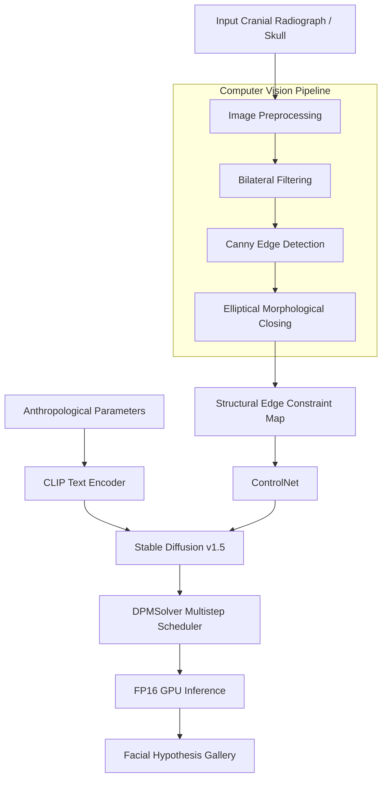
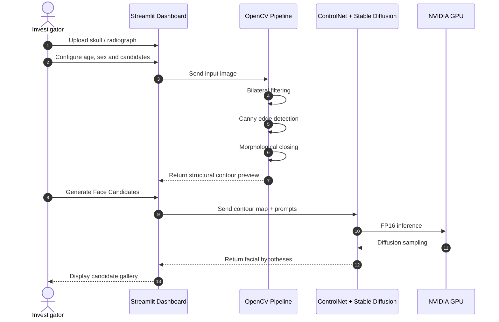
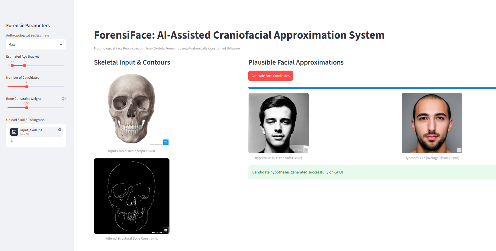

# ForensiFace — AI-Assisted Craniofacial Approximation System

> AI-assisted forensic lead-generation prototype for generating multiple plausible facial approximations from cranial skeletal structure using anatomically constrained diffusion.

ForensiFace is an experimental computer-vision and generative-AI system designed to assist forensic investigation workflows involving unidentified skeletal remains.

Instead of producing a single deterministic facial reconstruction, ForensiFace generates multiple plausible facial hypotheses while preserving structural constraints extracted from the input skull.

---

## ⚠️ Forensic Disclaimer

> **IMPORTANT INVESTIGATIVE LEAD NOTICE**
>
> ForensiFace generates synthetic facial approximations intended only to assist forensic teams and investigators in exploring potential missing-person candidate galleries.
>
> **The generated faces are NOT identity matches and must not be treated as legally verified identification.**
>
> Final identification must be established through appropriate secondary forensic standards such as DNA profiling, comparative dental records, fingerprint analysis, or other validated forensic procedures.

---

## 🚀 Overview

Traditional craniofacial reconstruction can involve manual reconstruction or deterministic facial approximation techniques. These approaches may produce a single facial hypothesis even though soft-tissue characteristics cannot be uniquely determined from skeletal structure alone.

ForensiFace treats craniofacial approximation as a **multi-hypothesis synthesis task**.

The system:

1. Accepts a frontal skull image or cranial radiograph.
2. Extracts structural skeletal contours.
3. Removes unwanted internal cavity artifacts.
4. Converts structural information into a ControlNet conditioning map.
5. Combines skeletal constraints with anthropological parameters.
6. Uses Stable Diffusion + ControlNet to generate multiple facial hypotheses.
7. Displays the generated approximations through an interactive Streamlit dashboard.

---

## 🎯 Problem Statement

When unidentified skeletal remains are discovered, investigators may have limited visual information about the individual's appearance.

Several challenges arise:

- Soft tissue is no longer available from skeletal remains.
- A single reconstruction can create anchoring or cognitive bias.
- Facial appearance cannot be uniquely determined from skull geometry alone.
- Different soft-tissue assumptions can result in different plausible facial appearances.
- Manual reconstruction can be time-consuming and difficult to reproduce.

Therefore, the objective of ForensiFace is not to determine a person's identity, but to create **multiple visually plausible investigative hypotheses** that may assist downstream forensic investigation.

---

## 💡 Proposed Solution

ForensiFace combines structural computer vision with conditional image generation.

### 1. Structural Constraint Extraction

The input skull image is processed using:

- Bilateral filtering
- Canny edge detection
- Morphological closing

This produces a simplified structural representation while reducing unwanted internal cavity artifacts.

### 2. Conditional Generation

The extracted structural map is passed to a ControlNet-conditioned Stable Diffusion pipeline.

The model receives:

- Skeletal structural constraints
- Estimated age bracket
- Sex parameter
- Soft-tissue profile

These parameters are used to generate different plausible facial hypotheses.

### 3. Multi-Hypothesis Output

Instead of producing one face, the application can generate multiple candidates with different soft-tissue assumptions, including:

- Lean
- Average
- Full
- Athletic

---

## ✨ Key Features

### 🦴 Morphological Contour Extraction

Extracts structural skull boundaries using image-processing operations while suppressing unwanted internal cavity information.

### 🧬 Multi-Hypothesis Facial Synthesis

Generates multiple facial approximations from the same skeletal input using different soft-tissue profiles.

### 🎛️ Anthropological Parameter Control

The dashboard provides controls for:

- Sex estimate
- Estimated age bracket
- Number of candidates
- Bone constraint weight

### 🖥️ Interactive Streamlit Dashboard

Provides an interactive interface for:

- Skull image upload
- Parameter configuration
- Structural contour visualization
- Candidate generation
- Side-by-side hypothesis comparison

### ⚡ GPU-Optimized Inference

Designed to operate on consumer GPUs with approximately 4 GB VRAM using:

- FP16 inference
- Attention slicing
- VAE slicing
- Explicit GPU memory cleanup

### 🔬 Investigative Lead Generation

The system is designed as an investigative assistance prototype rather than a biometric identification system.

---

## 🧠 How It Works

```text
                 ┌──────────────────────────┐
                 │  Skull / Cranial Image   │
                 └────────────┬─────────────┘
                              │
                              ▼
                 ┌──────────────────────────┐
                 │ Image Preprocessing      │
                 │                          │
                 │ • Bilateral Filtering    │
                 │ • Canny Edge Detection   │
                 │ • Morphological Closing  │
                 └────────────┬─────────────┘
                              │
                              ▼
                 ┌──────────────────────────┐
                 │ Structural Edge Map      │
                 └────────────┬─────────────┘
                              │
                              │
        ┌─────────────────────┘
        │
        ▼
┌──────────────────────────────┐
│ Anthropological Parameters   │
│                              │
│ • Sex                        │
│ • Age                        │
│ • Tissue Profile             │
└──────────────┬───────────────┘
               │
               ▼
      ┌────────────────────┐
      │ CLIP Text Encoder  │
      └─────────┬──────────┘
                │
                ▼
      ┌──────────────────────┐
      │ ControlNet + Stable  │
      │ Diffusion v1.5       │
      └──────────┬───────────┘
                 │
                 ▼
      ┌──────────────────────┐
      │ DPMSolver Scheduler  │
      │ FP16 GPU Inference   │
      └──────────┬───────────┘
                 │
                 ▼
      ┌──────────────────────┐
      │ Multiple Facial      │
      │ Hypotheses           │
      └──────────────────────┘
````

---

## 🏗️ System Architecture



---

## 🔄 End-to-End Workflow



---

## 🛠️ Technology Stack

| Category             | Technology             | Purpose                                 |
| -------------------- | ---------------------- | --------------------------------------- |
| Programming Language | Python 3.11            | Core application                        |
| Deep Learning        | PyTorch 2.5.1          | Tensor computation and GPU acceleration |
| CUDA                 | CUDA 12.1              | NVIDIA GPU acceleration                 |
| Generative AI        | Hugging Face Diffusers | Diffusion pipeline                      |
| Base Model           | Stable Diffusion v1.5  | Image generation                        |
| Conditioning         | ControlNet Canny       | Structural conditioning                 |
| Text Conditioning    | CLIP                   | Prompt embeddings                       |
| Computer Vision      | OpenCV                 | Filtering, edges and morphology         |
| Image Processing     | Pillow                 | Image loading and processing            |
| Web Interface        | Streamlit              | Interactive dashboard                   |
| GPU                  | NVIDIA RTX 3050 4GB    | Local inference                         |

---

## 🤖 AI/ML Pipeline

### 1. Input

The system accepts a frontal skull image or cranial radiograph.

Example:

```text
input_skull.jpg
```

### 2. Image Preprocessing

The raw image passes through several preprocessing operations.

#### Bilateral Filtering

Reduces image noise while preserving important structural boundaries.

```python
smooth = cv2.bilateralFilter(
    gray,
    9,
    75,
    75
)
```

#### Canny Edge Detection

Extracts prominent skeletal boundaries.

```python
edges = cv2.Canny(
    smooth,
    60,
    160
)
```

#### Morphological Closing

Helps reduce unwanted gaps and internal cavity artifacts.

```python
kernel = cv2.getStructuringElement(
    cv2.MORPH_ELLIPSE,
    (3, 3)
)

cleaned_edges = cv2.morphologyEx(
    edges,
    cv2.MORPH_CLOSE,
    kernel
)
```

---

## 🧠 Generative Model Pipeline

ForensiFace uses pretrained diffusion foundations rather than training a new diffusion model from scratch.

### Base Model

```text
Stable Diffusion v1.5
```

### Structural Conditioning

```text
ControlNet Canny
```

The extracted skull contours act as spatial conditioning information.

### Text Conditioning

Anthropological parameters are incorporated into the generation prompt.

Parameters include:

```text
Sex
Age bracket
Soft-tissue profile
```

### Sampling

The system uses:

```text
DPMSolverMultistepScheduler
```

with approximately:

```text
18 inference steps
```

and FP16 inference.

---

## 📊 Dataset & Pretrained Foundations

ForensiFace currently relies on pretrained generative foundations rather than a project-specific model trained from a newly collected forensic dataset.

### Generative Prior

```text
runwayml/stable-diffusion-v1-5
```

### Spatial Conditioning

```text
lllyasviel/sd-controlnet-canny
```

### Inference Input

The prototype uses frontal cranial images / 2D skeletal projections as inference inputs.

> The project should not be interpreted as a medically or forensically validated reconstruction model. Its generated outputs represent hypotheses produced by a generative model.

---

## 📁 Project Structure

```text
ForensiFace-AI-Assisted-Craniofacial-Approximation-System/
│
├── .gitignore
├── LICENSE
├── README.md
├── requirements.txt
│
├── app.py
├── generate_candidates.py
│
├── input_skull.jpg
├── skull_edges_preview.png
├── forensic_summary_grid.png
│
├── screenshots/
│   └── forensiface-dashboard.png
│
└── generated_candidates/
    ├── H1_Male_Lean.png
    ├── H2_Male_Avg.png
    └── ...
```

---

## ⚙️ Requirements

### Software

* Windows 10/11 64-bit or Linux
* Python 3.11
* NVIDIA GPU drivers compatible with CUDA 12.1
* Git

### Hardware

Development and testing environment:

```text
GPU: NVIDIA GeForce RTX 3050 Laptop GPU
VRAM: 4 GB
```

The implementation includes memory optimizations specifically intended to make local inference possible within this hardware constraint.

---

## 🔧 Installation

### 1. Clone the Repository

```bash
git clone https://github.com/prashant-00-22/ForensiFace-AI-Assisted-Craniofacial-Approximation-System.git

cd ForensiFace-AI-Assisted-Craniofacial-Approximation-System
```

### 2. Create a Virtual Environment

#### Windows

```powershell
py -3.11 -m venv venv

.\venv\Scripts\activate
```

#### Linux

```bash
python3.11 -m venv venv

source venv/bin/activate
```

### 3. Install PyTorch with CUDA 12.1

```bash
pip install torch torchvision --index-url https://download.pytorch.org/whl/cu121
```

### 4. Install Project Dependencies

```bash
pip install -r requirements.txt
```

### 5. Verify GPU Support

```bash
python -c "import torch; print('CUDA Available:', torch.cuda.is_available(), '| GPU:', torch.cuda.get_device_name(0))"
```

Expected output should indicate:

```text
CUDA Available: True
GPU: NVIDIA GeForce RTX 3050
```

---

## 🔐 Environment Variables

No paid third-party API is required for the basic local inference workflow.

An optional Hugging Face token can be configured to reduce model-download rate-limit issues.

Create:

```text
.env
```

Then add:

```env
HF_TOKEN=your_huggingface_read_token_here
```

Never commit real API keys or tokens to GitHub.

---

## ▶️ Running the Application

### Option 1 — Streamlit Dashboard

Start the interactive application:

```bash
streamlit run app.py
```

Then open:

```text
http://localhost:8501
```

### Option 2 — Batch Candidate Generation

Run the standalone generation script:

```bash
python generate_candidates.py
```

Generated candidates are stored in:

```text
generated_candidates/
```

---

## 🎛️ Using the Dashboard

### Step 1 — Select Anthropological Parameters

Configure:

```text
Sex Estimate
Age Bracket
Number of Candidates
Bone Constraint Weight
```

### Step 2 — Upload Skull Image

Upload a frontal skull image or cranial radiograph.

### Step 3 — Inspect Structural Constraints

The application displays the processed structural contour map.

This allows the user to visually inspect the skeletal features being passed to the generative pipeline.

### Step 4 — Generate Candidates

Click:

```text
Generate Face Candidates
```

### Step 5 — Compare Hypotheses

The generated facial approximations are displayed side-by-side.

Different hypotheses can represent different soft-tissue assumptions.

---

## 📸 Results & Dashboard Preview

### Interactive Web Application

The following screenshot demonstrates the complete workflow:

* Anthropological parameter configuration
* Skull input
* Structural contour extraction
* Candidate generation
* Multiple facial hypotheses



### Example Output

```text
                 INPUT
                   │
                   ▼
           Skull / Radiograph
                   │
                   ▼
        Structural Contour Map
                   │
                   ▼
          ControlNet Conditioning
                   │
                   ▼
        Diffusion-based Generation
                   │
          ┌────────┴────────┐
          ▼                 ▼
       Hypothesis 1      Hypothesis 2
       Lean Tissue      Average Tissue
```

Example project outputs:

| Stage                  | Example                   |
| ---------------------- | ------------------------- |
| Input                  | `input_skull.jpg`         |
| Structural constraints | `skull_edges_preview.png` |
| Hypothesis 1           | `H1_Male_Lean.png`        |
| Hypothesis 2           | `H2_Male_Avg.png`         |

---

## ⚡ Performance & Memory Optimization

Running a diffusion model on a 4 GB GPU introduces significant memory constraints.

ForensiFace implements several optimizations.

### FP16 Inference

The pipeline operates using:

```text
torch.float16
```

to reduce GPU memory consumption.

### Attention Slicing

```python
pipe.enable_attention_slicing(slice_size=1)
```

This reduces peak attention-memory requirements.

### VAE Slicing

VAE decoding is performed using slicing to reduce memory spikes during image generation.

### Direct GPU Mapping

The pipeline is loaded directly onto:

```text
cuda:0
```

instead of relying on CPU offloading mechanisms that previously caused `meta` tensor issues.

### Explicit Memory Cleanup

Between candidate generation iterations:

```python
gc.collect()
torch.cuda.empty_cache()
```

are used to reduce memory accumulation.

---

## 📈 Empirical Observations

Testing was performed on an NVIDIA GeForce RTX 3050 Laptop GPU with 4 GB VRAM.

### Inference Time

Observed inference times were approximately:

```text
18–33 seconds per image
```

during Streamlit interactive runs.

Initial cold-cache script generation was observed around:

```text
19–46 seconds
```

using 18 DPMSolver inference steps at 512 × 512 resolution.

### Memory Stability

The implemented memory optimizations allow the pipeline to operate within the 4 GB hardware environment without the previously encountered fatal OOM interruptions.

### Structural Adherence

The generated outputs were observed to retain major structural relationships such as:

* Mandibular boundaries
* Eye socket positioning
* Nasal base positioning

These observations should be considered **experimental**, not forensic validation metrics.

---

## 🧩 Challenges & Engineering Solutions

| Challenge                                       | Cause                                                    | Solution                                    |
| ----------------------------------------------- | -------------------------------------------------------- | ------------------------------------------- |
| Hollow / ghost-like facial artifacts            | Internal skull cavities were detected by edge extraction | Bilateral filtering + morphological closing |
| Excessive GPU memory usage                      | Diffusion model memory requirements                      | FP16 + attention slicing + VAE slicing      |
| `Tensor on device meta` error                   | CPU offloading created placeholder tensors               | Direct CUDA pipeline loading                |
| Python C-extension conflicts                    | Incompatible Python/dependency environment               | Standardized environment on Python 3.11     |
| Internal eye/teeth edges influencing generation | Raw Canny output contained cavity structures             | Morphological preprocessing                 |

---

## ⚠️ Limitations

ForensiFace is an experimental research prototype and has several limitations.

### 1. 2D Input Constraint

The current implementation primarily works with frontal 2D skull/radiographic inputs.

### 2. Missing or Damaged Bone

Severe cranial trauma or missing mandibular regions may reduce structural conditioning quality.

### 3. Appearance Cannot Be Determined From Bone Alone

Features such as:

* Hair style
* Eye pigmentation
* Facial hair
* Skin appearance
* Soft-tissue characteristics

cannot be reliably determined from skeletal structure alone.

The diffusion model therefore introduces learned generative priors.

### 4. Resolution

The current pipeline primarily generates images at:

```text
512 × 512
```

to remain practical on 4 GB VRAM hardware.

### 5. No Identity Verification

The system does not currently perform validated biometric identification.

Generated faces are hypotheses, not identity matches.

---

## 🔮 Future Scope

### 3D CT-Based Reconstruction

Process DICOM/3D CT information to generate:

* Frontal views
* Profile views
* 45° oblique views

### Experimental Candidate Ranking

Future research could investigate facial embedding models such as:

```text
ArcFace
FaceNet
```

for experimental comparison of generated hypotheses against controlled candidate galleries.

> This functionality is **not part of the current implementation**.

### Soft-Tissue Landmark Calibration

Future versions could incorporate empirical tissue-depth landmark datasets to provide more controlled soft-tissue parameterization.

### Improved Anatomical Conditioning

Future work could investigate stronger landmark-level conditioning rather than relying primarily on edge maps.

---

## 🧪 Experimental Nature

ForensiFace should be understood as:

```text
Research Prototype
        +
Computer Vision Pipeline
        +
Generative AI
        +
Investigative Hypothesis Generation
```

It is **not** a replacement for:

* DNA analysis
* Fingerprint identification
* Dental identification
* Professional forensic reconstruction
* Validated biometric identification systems

---

## 🔒 Security & Privacy Considerations

When working with real forensic material:

* Do not upload sensitive forensic images to public repositories.
* Do not commit personally identifiable information.
* Do not commit real investigation records.
* Do not store authentication tokens in source code.
* Use synthetic or legally authorized test data during development.
* Follow applicable institutional, legal, and forensic data-handling requirements.

The sample assets included in this repository should not be interpreted as verified forensic evidence.

---

## 🤝 Contributing

Contributions are welcome, particularly around:

* Anatomical conditioning
* Image preprocessing
* Memory optimization
* 3D reconstruction
* Soft-tissue modeling
* Evaluation methodologies
* Documentation

### Contribution Workflow

```bash
git checkout -b feature/your-feature

git add .

git commit -m "feat: describe your change"

git push origin feature/your-feature
```

Then open a Pull Request.

---

## 📚 References

### Stable Diffusion

Rombach et al.

**High-Resolution Image Synthesis with Latent Diffusion Models**

CVPR 2022.

### ControlNet

Zhang & Agrawala.

**Adding Conditional Control to Text-to-Image Diffusion Models**

ICCV 2023.

### Hugging Face Diffusers

The project uses the Diffusers ecosystem for diffusion-model pipeline implementation and inference.

### Forensic Reconstruction Research

The project is conceptually inspired by research into craniofacial reconstruction and multi-hypothesis generative approaches.

---

## 👨‍💻 Author

### Prashant

**Computer Science & Engineering — Artificial Intelligence & Machine Learning**

GitHub: [@prashant-00-22](https://github.com/prashant-00-22)

Email: [prashantsharma0422@gmail.com](mailto:prashantsharma0422@gmail.com)

---

## 📄 License

This project is distributed under the **MIT License**.

See the `LICENSE` file for the complete license text.

---

## ⭐ Project Summary

ForensiFace explores how **computer vision + conditional diffusion models** can be combined to transform skeletal structural information into multiple plausible facial hypotheses.

The core pipeline is:

```text
Skull Image
     ↓
Bilateral Filtering
     ↓
Canny Edge Detection
     ↓
Morphological Closing
     ↓
Structural Constraint Map
     ↓
ControlNet
     ↓
Stable Diffusion
     ↓
FP16 GPU Inference
     ↓
Multiple Facial Hypotheses
```

> **ForensiFace is an experimental AI research prototype for investigative hypothesis generation, not an identity-verification system.**
```
```
